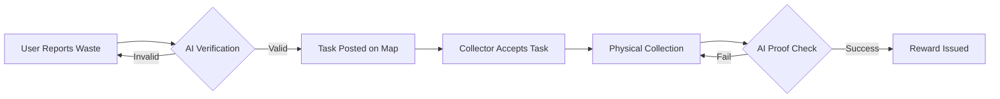

# 🌿 EchoWise AI: Circular Economy Ecosystem

<p align="center">
  
</p>

<p align="center">
  <strong>Empowering communities to turn waste into wealth through AI-driven verification and Web3 incentives.</strong>
</p>

<p align="center">
  <a href="https://echowise-ai.onrender.com/"><strong>🌐 Explore the Live Platform</strong></a>
</p>

---

## ✨ Overview

EchoWise is a next-generation waste management and recycling platform that leverages **Artificial Intelligence** and **Web3** to incentivize environmental responsibility. We bridge the gap between concerned citizens, local waste collectors, and industrial recyclers, turning a logistical challenge into a rewarding community ecosystem.

---

## 🚀 Key Features

### 🤖 AI-Powered Waste Reporting
*   **Intelligent Recognition**: Upload a photo, and our Gemini 1.5 Flash AI identifies waste types (Plastic, Organic, Metal, etc.) and estimates quantity instantly.
*   **Smart Geolocation**: Automated GPS tagging ensures collectors find reports with surgical precision.

### 🛡️ Verified Collection & Anti-Fraud
*   **Dual-Photo Verification**: Collectors must provide a "proof-of-pickup" image which is AI-matched against the original report.
*   **Image Hashing**: Prevents fraud by ensuring the same image isn't used for multiple reports or collections.
*   **Self-Report Protection**: Users are restricted from collecting their own reports to maintain ecosystem integrity.

### 💎 Incentivized Gamification
*   **Tokenized Rewards**: Earn points for every verified action, powered by Web3 infrastructure.
*   **Leaderboards**: Rise through the ranks of "Echo-Heroes" in your local community.
*   **Dynamic Rewards**: Redeem earned points for sustainable products or services.

### 📧 Seamless Communication
*   **Direct Outreach**: Built-in "Contact Reporter" functionality allows collectors to coordinate with reporters via pre-filled secure email templates.

---

## 🗺️ How It Works



---

## 🛠 Tech Stack

| Category | Technology |
| :--- | :--- |
| **Framework** |   |
| **Styling** |  |
| **Database** |   |
| **AI** |  |
| **Auth/Web3** |  |

---

## ⚙️ Environment Setup

1.  **Clone & Install**
    ```bash
    git clone <repo-url>
    cd ECHO-WISE-UPDATES
    npm install
    ```

2.  **Configure Environment** (`.env.local`)
    ```env
    NEXT_PUBLIC_GOOGLE_MAPS_API_KEY="your_key"
    NEXT_PUBLIC_GEMINI_API_KEY="your_key"
    DATABASE_URL="your_neon_url"
    NEXT_PUBLIC_APP_URL="http://localhost:3000"
    ```

3.  **Sync Database & Start**
    ```bash
    npm run db:push
    npm run dev
    ```

---

## 📈 The Business Vision

EchoWise isn't just an app; it's **Sustainability-as-a-Service**. By providing AI-verified, granular recycling data, we help corporations meet **ESG targets** and **EPR compliance** laws, turning waste management from a cost center into a value-generating data ecosystem.

---

## ⚖️ License

Distributed under the MIT License. See `LICENSE` for more information.

<p align="center">
  Built with ❤️ for a Greener Planet 🌏
</p>
